## IEEE-CIS Fraud Detection

### კონკურსის მიმოხილვა
* IEEE-CIS Fraud Detection კონკურსის მიზანია ტრანზაქციის თაღლითურობის დაპროგნოზება. ამისათვის გადმოგვეცემა ტრანზაქციების სიმრავლე ისეთი მახასიათებლებით, როგორებიცაა გადარიცხული თანხა, ბარათის ტიპი (mastercard, visa...) და ა.შ. ჩვენი მიზანია ავაგოთ ისეთი მოდელი, რომელიც დააპროგნოზებს რაღაც ალბათობით შემოსული ტრანზაქცია თაღლითურია თუ არა.

* საბოლოოდ, უნდა დავაგენერიროთ submission.csv, რომელშიც პირველი სვეტი *TransactioID*-ია, ხოლო მეორე სვეტი ალბათობა იმისა, თაღლითურია, თუ არა შესაბამისი ტრანზაქცია.

* ჩვენი მოდელი ფასდება **Area Under The ROC Curve** მეტრიკით, რაც გულისხმობს, მოდელი რამდენად სწორად ალაგებს ერთმანეთის მიმართ თაღლითური და არათაღლითური ტრანსაქციების ალბათობებს (თაღლითურის ალბათობები უფრო მეტი უნდა იყოს ვიდრე არათაღლითურების). ანუ, **არ მოგვეთხოვება** ეს ალბათობები იყოს **Calibrated**. შესაბამისად, შესაძლოა მოდელს მაღალი შედეგი ჰქონდეს **Area Under The ROC Curve** მეტრიკით, თუმცა **არ არის აუცილებელი** მოდელის დაბრუნებული ალბათობა შინაარსიანი და სასარგებლო ინფორმაციის მატარებელი იყოს. მაგალითად, თუ სატესტო სიმრავლეა: 
```python

# (TransactioID, isFraud)
test = {
    (1, 1),
    (2, 1),
    (3, 0),
}
```
და ჩვენმა მოდელმა დააბრუნა:
```python
pred = {
    (1, 0.1),
    (2, 0.01),
    (3, 0.005),
}
```
მოდელს კარგი შედეგი ექნება **ROC AUC** მეტრიკაზე, თუმცა **Calibrated** არ იქნება. **Brier Score** ან **Log-Loss** ცუდი ექნება, რადგან დიდი თავდაჯერებით მისცა საკმად დაბალი ალბათობა თაღლითურ ტრანზაქციებს. ანუ, მოდელს შეუძლია სწორად დაალაგოს ტრანზაქციები, თუმცა ალბათობები შეიძლება რეალობას არ ასახავდეს. 

---
### მიდგომა

* დავიწყე შედარებით მარტივი DataProcessing-ისა და მოდელების აგებით, რათა დაახლოებით გამეგო ამოცანის სირთულე. თავიდან ავაგე baseline მოდელები (LogisticRegression, DecisionTree, RandomForest, XGBoost) საკმაოდ მარტივი და straightforward preprocessing-ით. თითოეული არქიტექტურისთვის ავაგე საბაზისო,  თუმცა ყველასათვის მაინც ოდნავ განსხვავებული preprocessing, რაც შემდეგ ნაწილებში შეგვიძლია უფრო დეტალურად განვიხილოთ. მას შემდეგ რაც გავიგე baseline მოდელების შედგები, ავირჩიე ერთი საუკეთესო არქიტექტურა და ამ მოდელის არქიტექტურისთვის უკვე თანდათან ვაუმჯობესებდი DataProcessing მიდგომებსა და უშუალოდ ამ მოდელის ჰიპერპარამეტრებს.

---
### რეპოზიტორიის სტრუქტურა

```
IEEE-CIS Fraud Detection/
│
├── ieee-fraud-model-data-exploration-ipynb             ← EDA, მონაცემების ანალიზი 
├── ieee-fraud-model-logistic-regression.ipynb          ← preprocessing, ექსპერიმენტები logistic regression-ზე
├── ieee-fraud-model-logistic-regression-2.ipynb        ← preprocessing, ექსპერიმენტები logistic regression-ზე
├── house-prices-model-decision-tree.ipynb              ← preprocessing, ექსპერიმენტები
├── house-prices-model-random-forest.ipynb              ← preprocessing, ექსპერიმენტები
├── house-prices-model-xgboost.ipynb                    ← preprocessing, ექსპერიმენტები
├── house-prices-model-inference.ipynb                  ← საუკეთესო მოდელის ჩამოტვირთვა, პროგნოზი, submission
├── README.md
```

---

## ფაილების აღწერა

* ieee-fraud-model-data-exploration-ipynb   - EDA, მონაცემების ანალიზი
* ieee-fraud-model-inference.ipynb          - საუკეთესო მოდელის ჩამოტვირთვა და პროგნოზი
* ieee-fraud-model-*.ipynb                  - სხვადასხვა DataProcessing-ის მიდგომები  და სხვადასხვა არქიტექტურის მოდელების ექსპერიმენტები მოცემული DataProcessing-ის მიხედვით (თითო preprocessing მიდგომა და model architecture თითო ფაილში). 

---

*ieee-fraud-model-\*.ipynb* ფაილების სტრუქტურა მსგავსია:

## Read & Split Data

* წავიკითხე **data**.csv და ვინახავ DataFrame ობიექტებში.


* დავყავი **data** სამ ნაწილად: *train*, *validation*, *test*.

## Data Cleaning

* შევქმენი custom ან sklearn ბიბილიოთეკის pipeline-ის ობიექტები სვეტებთან სამუშაოდ. 


* feature-ები, რომლების დამუშავებასაც ერთნაირი მიდგომებით ვაპირებ, ერთად დავაჯგუფე.


* ყოველი ჯგუფისთვის შევქმენი მცირე pipeline, რომლებსაც საბოლოოდ აერთიანებს *preprocessor* ობიექტი. 

## Preprocessing Pipeline

* ამ ნაწილში ერთ *preprocessor* ობიექტში ვაერთიანებ ყველა წინა მიღებულ Data Cleaning ობიექტებს. 

მაგალითად:
```python
preprocessor = Pipeline([
    ('col_dropper', col_dropper),
    ('na_imputer',  imputer),
    ('scaler',      scaler),
    ('rfe',         selector),
])
```


## Full Pipeline

* ამ წაწილში უკვე ვაწყობ *full_pipeline* მოდელს, რომელიც *preprocessor*-თან ერთად მოიცავს რომელიმე არქიტექტურის მოდელსაც.

მაგალითად: 
```python
full_pipeline = Pipeline([
    ('preprocessor', preprocessor),
    ('model',        LogisticRegression()),
])
```

### MLflow Logging

* საბოლოო pipeline-ს შესაძლოა ჰქონდეს ბევრი ჰიპერპარამეტრი, როგორც preprocessing, ისე მოდელის არქიტექტურის ნაწილში.


* შესაბამისად, ამ ნაწილში გადავარჩევ ორივე ნაწილის ჰიპერპარამეტრებს GridSearch სტილში, პარალელურად ვქმნი შესაბამის **experiment**-ებსა და **run**-ებს **MLflow**-ზე და ვლოგავ პარამეტრების თითოეული კომბინაციის მეტრიკებს, პარამეტრებს და მთლიან *full_pipeline* ობიექტს.


---

# General Remarks

*ieee-fraud-model-\*.ipynb* თითოეული ფაილში preprocessing-ის სხვადასხვა მიდგომა მაქვს. შესაბამისად, preprocessing მიდგომების ერთიანად აღწერა ერთ პუნქტში საკმაოდ რთულია. აჯობებს მოდელების არქიტექტურების მიხედვით თანმიმდევრულად განვიხილოთ მიდგომები, შედეგები და საინტერესო ქცევები, რომლებიც cross validation პროცესში გამოჩნდა.

თუმცა, სანამ უშუალოდ თითოეული არქიტექტურისთვის მიდგომების აღწერაზე გადავალთ, ზოგადად განვიხილოთ რა **data** დამხვდა, რა იყო პირველი ნაბიჯები. ეს ყველაფერი საერთოა თითოეული *ieee-fraud-model-\*.ipynb* ფაილისთვის:   

* დამხვდა ორ-ორი csv ფაილი, *train_transaction.csv*, *train_identity.csv* და *test_transaction.csv*, *test_identity.csv*. train-ის ორივე ფაილში ჩავიხედე. ამ ორ ფაილს საერთო ჰქონდათ `TransactioID` სვეტი. *train_identity.csv*-ის `TransactioID`-ის სვეტის მნიშვნელობები *train_transaction.csv*-ის `TransactioID`-ის ქვესიმრავლე იყო. ანუ, *train_identity.csv*-ში მხოლოდ ზოგიერთი ტრანზაქციისთვის მოგვცეს დამატებითი ცვლადები, რომლებიც მოპოვებაც შეძლეს. ვვარაუდობ, რომ ორად უბრალოდ მეხსიერების დაზოგვისთვის მიზნით დააცალკევეს *\*_transaction* და *\*_identity* ფაილები და განსაკუთრებული მიზეზი არ უნდა ჰქონდეს.

* *train_transaction.csv*, *train_identity.csv* დავაჯოინე ერთმანეთთან და მივიღე:
```python
    df = pd.merge(df_transaction, df_identity, on='TransactionID', how='left')
    print('Train shape:', df.shape)
    
    --- Train shape: (590540, 434) ---
```
**datapoint**-ების რაოდენობა საკმაოდ ბევრია, ანუ ეს ამოცანა computation-ის მხრივ *complex* და *expensive* შეიძლება იყოს.


* ამის შემდეგ შევხედე გავაკეთე data split. რადგან **datapoint**-ების რაოდენობა ისედაც საკმაოდ დიდია, გადავწყვიტე, რომ *kfold cross validation* არ არის საჭირო ამ ეტაპისთვის. ავირჩიე შედარებით უფრო მარტივი მიდგომა და `df` დავყავი `train_df`, `val_df`, `test_df` ნაწილებად. აქ ერთი მარტივი მიდგომა იქნებოდა, რომ `df` დამეყო randomized გზით, თუმცა ეს მიდგომა არც ისე სწორი გამოდგებოდა. ჩავთვალე, რომ ამოცანის მთავარი მიზანია მომავალში შემოსული ტრანზაქციის თაღლითურობის დადგენა. შესაბამისად, მონაცემების randomized გზით დაყოფის შემთხვევაში `train_df`-ში მოხვედრილი ტრანზაქციები შესაძლოა დროით უსწრებდეს `val_df` ან `test_df`-ში ჩავარდნილ ტრანზაქციებს. შესაბამისად, `train_df`-ით მოდელი ისწავლის 'მომავლის' პატერნებს და `val_df`-ზე ან `test_df` ბევრად უფრო ოპტიმისტური შედეგები ექნება მოდელს, ვიდრე ეს რეალობაში იქნება deployment-ის დროს. ამიტომ, გადავწყვიტე მოდელი დამეყო `TransactionDT` სვეტის მიხედვით 70/15/15 განაწილებით:
```python
    sorted_df = df.sort_values(by='TransactionDT')

    train_size = int(sorted_df.shape[0] * .7)
    val_size   = int(sorted_df.shape[0] * .15)

    train_df = sorted_df.iloc[:train_size]
    val_df   = sorted_df.iloc[train_size: train_size + val_size]
    test_df  = sorted_df.iloc[train_size + val_size:]
```

* ამას გარდა, კიდევ ერთი მნიშვნელოვანი ნაწილი იყო **data prevalence**-ის გაგება, ანუ მონაცემები **imbalanced** იყო თუ არა. ამისათვის ავაგე plot პროცენტულობით:

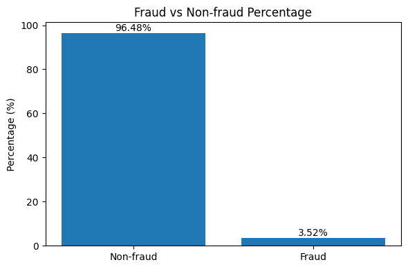

ვხედავთ, რომ მონაცემები საკმაოდ დაუბალანსებულია. შესაბამისად, მნიშვნელოვანია, რომ ზემოთ დროის მიხედვით დაყოფილ `train_df`, `val_df`, `test_df`, **0.035**-თან ახლოს იყოს **prevalence**-ები:
```python
    print('Train shape:',      train_df.shape, '\nTrain prevalence:',      train_df[TARGET].sum() / train_df.shape[0], '\n')
    print('Validation shape:', val_df.shape,   '\nValidation prevalence:', val_df[TARGET].sum()   / val_df.shape[0],   '\n')
    print('Test shape:',       test_df.shape,  '\nTest prevalence:',       test_df[TARGET].sum()  / test_df.shape[0],  '\n')

    --- Train shape: (413378, 434)                  --- 
    --- Train prevalence: 0.03516878014795175       ---

    --- Validation shape: (88581, 434)              ---
    --- Validation prevalence: 0.03434145019812375  ---

    --- Test shape: (88581, 434)                    ---
    --- Test prevalence: 0.03480430340592226        ---
```
ვხედავთ, რომ სამივე ნაწილს დაახლოებით ტოლი **prevalence** აქვთ, ანუ ამ მხრივ, პრობლემა არ გვაქვს. 

---

# Additional Technical Remarks

* რადგან ძალიან დიდი რაოდენობის **datapoint** გვაქვს, ტრენინგის ნაწილი დროის მხრივ საკმაოდ ძვირი აღმოჩნდა. მაგალითად, `Logistic Regression`-ის **l1** რეგულარიზაციის **saga** მოდელს 4 საათი ველოდე (**l2** რამდენიმე წუთში რჩებოდა, რადგან მათემატიკურად უფრო მარტივი დაოპტიმიზებადია). მარტო **cpu**-ით ძალიან რთული იქნებოდა უფრო დიდი მოდელების ტრენინგი. შესაბამისად, გამოვიყენე kaggle-ის **gpu**-ები (**30h** quota per week). **gpu**-ებით 4 საათის საქმე რამდენიმე წამში კეთდებოდა და ძალიან დამეხმარა cross validation პროცესში. თუმცა, **gpu**-ს გამოსაყენებლად გვჭირდება თვითონ პითონის ობიექტს ჰქონდეს ამის support. აღმოჩნდა, რომ **sklearn**-ის უმეტეს ობიექტებს ასე პირდაპირ არ აქვთ support, თუმცა არსებობს **cuml** ბიბლიოთეკა, რომელსაც **sklearn**-ის ანალოგი მოდელები აქვს და **gpu**-ს support-იც აქვს. მაგალითად, გამოვიყენე cuml.LogisticRegression sklearn.LogisticRegression-ის ნაცვლად. თუმცა, sklearn.LogisticRegression-სგან განსხვავებით, cuml.LogisticRegression-ს ერთადერთი `solver` აქვს, qn (Quasi-Newton). მაგრამ, `solver`-ს ზოგადად დიდი მნიშვნელობა არ აქვს, ყველა `solver` საბოლოო ჯამში ერთ ოპტიმალურ კოეფიციენტების წერტილში მიდის. ამიტომაც, გამოვიყენე **gpu-accelerated** cuml.LogisticRegression. აქვე უნდა აღინიშნოს, რომ cuml.LogisticRegression-ს გასაშვებად **gpu** აუცილებლად სჭირდება. მაგრამ, MLflow-ზე შენახული *full_pipeline*-ის ჩამოტვირთვისას შეიძლება მარტო **cpu** მქონდეს მოცემულ მანქანაზე. ამ პრობლემის გადასაჭრელად, გამოვიყენე cuml.LogisticRegression-ის `as_sklearn` ფუნქცია, რომელსაც cuml.LogisticRegression გადაჰყავს sklearn.LogisticRegression ობიექტში:
```python
    sklearn_model = cuml_model.as_sklearn()
```
**gpu** ძალიან კომფორტული აღმოჩნდა და საინტერესო გამოცდილება იყო.


---

# Back To Models

ახლა, შეგვიძლია გადავიდეთ უშუალოდ მოდელების ნაწილზე.

---

# Logistic Regression

## Preprocessing

მიდგომა საკმაოდ მარტივია:

* გადავაგდე არაინფორმაციული სვეტები:
```python
# TransactionId is not informative feature so we remove it

irrelevant_cols = [
    'TransactionID',
]

irrelevant_cols_dropper = ColumnTransformer(
    transformers=[
        ('drop', 'drop', irrelevant_cols),
    ],
    remainder='passthrough',
    verbose_feature_names_out=False,
).set_output(transform='pandas')
```

* რიცხვით სვეტებში **NA**-ის შევსება ვცადე ორი მიდგომით: *median* და *mean*. ეს ორი სხვადასხვა ექსპერიმენტში დავლოგე.


* კატეგორიული სვეტები შევავსე TargetEncoding-ით, რომელიც სვეტში თითოეულ კატეგორიას ანაცვლებს მისი target (isFraud) საშუალო მნიშვნელობით. ეს მიდგომა იმიტომ ავირჩიე, რომ ერთი - მარტივია baseline-სთვის და მეორე - სვეტში ისეთ კატეგორიას, რომლისთვისაც fraud ტრანზაქციის rate მაღალია, დიდ მნიშვნელობას მიანიჭებს, ხოლო ისეთ კატეგორიას, რომლისთვისაც fraud ტრანზაქციის rate დაბალია, პატარა მნიშვნელობას მიანიჭებს.


* ამის შემდეგ მთლიანი data დავანორმალიზე *StandardScaler*-ით. ეს საჭიროა რეგულარიზაციისთვის, რადგან წონები თანაბრად შ 


* სვეტები high NA-ს გამო აქ არ გადამიგდია. შესაძლოა ის, რომ ტრანზაქციის feature არის NA, პირიქით, მიანიშნებდეს იმაზე, რომ ტრანზაქვია არის ან არ არის fraud.  

## Training & Results

* ტრენინგის დროს მოდელებს გადავეცი `'class_weight': ['balanced']`, რადგან უფრო მეტი წონა მიანიჭონ უმცირესობის კლასს `loss` ფუნქციაში. `undersampling` ვცადე, მაგრამ ოდნავ უარეს შედეგებს მიდებდა *LogisticRegression*-ზე ამიტომ `class_weight`-ის მინიჭებები გადავწყვიტე. ასევე, შევნიშნოთ, რომ *LogisticRegression* აქვს **C** პარამეტრი, რომელიც რეგულარიზაციის პარამეტრის უკუპროპორციულია.


* ამ preprocessing-ით დავატრენინგე რამდენიმე არქიტექტურა (`l1`, `l2`, `elasticnet`) და გადავარჩიე ბევრი რეგულარიზაციის პარამეტრი:
```python
    model_configs_l1 = {
        'C':            [1e-5, 5e-5, 1e-4, 5e-4, 1e-3, 5e-3, 1e-2, 5e-2, 1e-1, 5e-1, 1, 5, 10, 50, 100, 500, 1000, 5000, 10000, 100000, np.inf]
        'penalty':      ['l1',],
        'solver':       ['qn'],
        'class_weight': ['balanced'],
        'max_iter':     [10000],
    }
    
    model_configs_l2 = {
        'C':            [1e-5, 5e-5, 1e-4, 5e-4, 1e-3, 5e-3, 1e-2, 5e-2, 1e-1, 5e-1, 1, 5, 10, 50, 100, 500, 1000, 5000, 10000, 100000, np.inf]
        'penalty':      ['l2',],
        'solver':       ['qn'],
        'class_weight': ['balanced'],
        'max_iter':     [10000],
    }

    model_configs_elasticnet = {
        'penalty':       ['elasticnet'],
        'C':             [1e-4, 5e-4, 1e-3, 5e-3, 1e-2, 5e-2, 1e-1, 5e-1, 1, 5, 10, 100, 1000, 10000],
        'l1_ratio':      [.1, .3, .5, .7, .9], 
        'class_weight':  ['balanced'],
        'solver':       ['qn'],
        'max_iter':      [10000],
    }
```

* ეს შედეგები ერთმანდეთს შევადარე და საკმაოდ საინტერესო პატერნები გამოჩნდა. მაგალითად, ეს არის l1 და l2 რეგულარიზაციის მოდელების plot-ები:

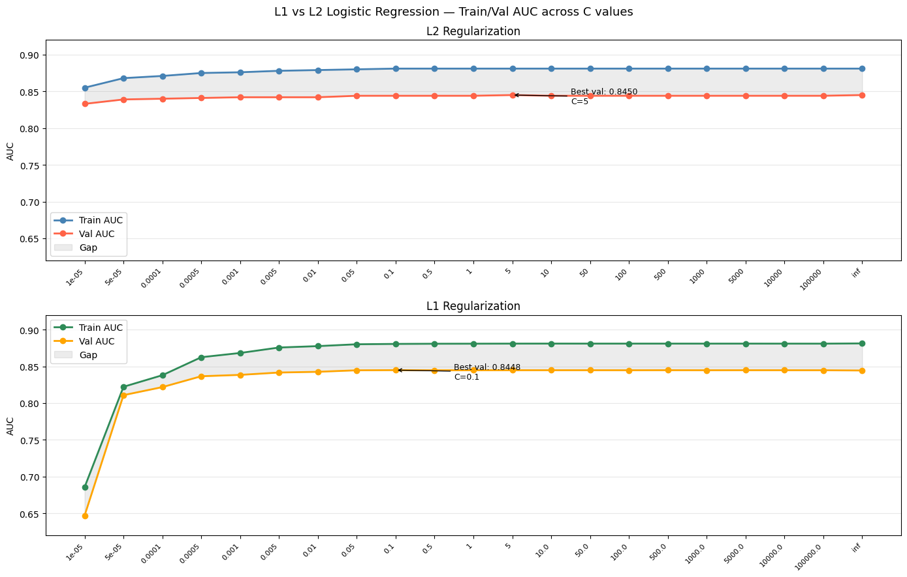

* `C=1e-5` ანუ დიდი რეგულარიზაციის პარამეტრის დასეტვის დროს, l2-ს უკეთესი შედეგები აქვს. ამის მიზეზი ის არის, რომ l2 რეგულარიზაცია **smooth** არის ანუ ბოლომდე არ ანულებს ცვლადების წონებს მაღალი რეგულარიზაციის კოეფიციენტის დროსაც კი. l1 რეგულარიზაცია შედარებით **sharp** არის და ცვლადების კოეფიციენტებს პირდაპირ ანულებს, განსაკუთრებით მაღალი რეგულარიზაციის კოეფიციენტის დროს. შესაბამისად, l1-ის შემთხვევაში **underfit** ბევრად უფრო მკვეთრად ჩანს. მაღალი რეგულარიზაციის კოეფიციენტის გამო მოდელს უწევს ბევრი feature -ის წონის განულება. l2 ამ დროს სავარაუდოდ ყველა წონის შემცირების ხარჯზე ახერხებს უკეთესი შედეგის აღებას. 

* სხვა შემთხვევაში ამ ორ მოდელს დაახლოებით იგივე შედეგები აქვთ. ვხედავთ, რომ l2-ს უფრო **smooth** ტეხილი აქვს, ხოლო l1-ს უფრო **sharp** დასაწყისში.


* l1-სთვის საუკეთესო შედეგი **C=0.1** -ის დროს, **train_auc=0.880**, **val_auc=0.844**, ხოლო l2-სთვის საუკეთესო შედეგი მიიღწევა **C=5** -ის დროს, **train_auc=0.881**, **val_auc=0.845**. ოდნავ აჯობა l2-მა, მაგრამ დიდად არაფერს ნიშნავს ეს სხვაობა. 


* **overfit**-ის მხრივ ამ გრაფიკებიდან ჩანს, რომ l1 ბევრად არასტაბილურად რეაგირებს მაღალ რეგულარიზაციის კოეფიციენტებზე, ვიდრე l2. ამის მიზეზი კიდევ ერთხელ ის არის, რომ l1 უფრო *aggresive* არის და სვეტების წონებს პირდაპირ ანულებს. გარკვეულის C-ს შემდეგ მოდელებისთვის **overfit gap** ხდება სტაბილური, დაახლოებით **0.035-0.04**. 


ეს უკვე elasticnet-ის plot-ია:

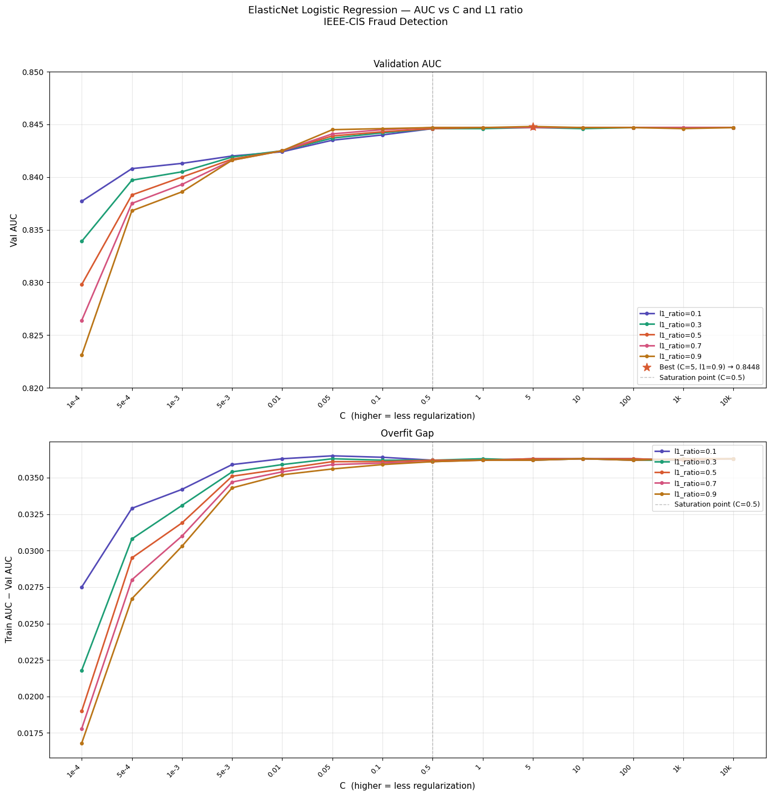


* აქაც მასშტაბები საკმაოდ მცირეა, რადგან *LogisticRegression*-ის არქიტექტურას უჭირს ამ დატაზე სწავლა. თუმცა, მცირე სხვაობები მაინც ჩანს.


* მოდელს საკმარისად დიდი C-სთვის აშკარად l1 რეგულარიზაცია ურჩევნია. უკვე **C=0.05**-ის დროს უსწრებს **l1_ratio=0.9** დანარჩენს მოდელებს და საუკეთესო შედეგიც ამ დროს მიიღწევა.


* აქაც მცირე C-ს დროს **overfit gap** არის ძალიან პატარა, რადგან მოდელი ვერაფერს იმახსოვრებს და ცდილობს შეზღუდული წონებით memorization-ის გარეშე საუკეთესო შედეგი დადოს.


* მცირე C-ების დროს ძალიან ბუნებრივად ლაგდება წერტილები **l1_ratio**-ს მიხედვით, რაც ისედაც მოსალოდნელი იყო. რაც უფრო მაღალია **l1_ratio** მით უფრო პატარა **overfit gap** აქვს და ოდნავ უფრო მაღალი **underfit** შედეგი აქვს დაბალი **val_auc**-ს გამო. 


* ასევე, შევნიშნოთ, რომ **C=0.5**-ის მერე მოდელის შედეგები **val_auc**-სა და **overfit gap**-ზე ბრტყელდება. ეს იმას შეიძლება ნიშნავდეს, რომ *LogisticRegression* პატარა რეგულარიზაციის პარამეტრის დროსაც კი ვერ იზეპირებს დატას, რადგან სუსტი არქიტექტურა აქვს. უფრო ძლიერი არქიტექტურის მოდელებისთვის მოველი, რომ **overfit_gap** ბევრად მაღალი იქნება რეგულარიზაციის გარეშე და **train_auc** საერთოდ 1-თან ძალიან ახლოს მივა. 


* რადგან მოდელი **l1_ratio**-ის დროს უფრო კარგ შედეგებზე გადის, ეს შეიძლება იმას ნიშნავდეს, რომ დატაში დიდი **noise** არის, რადგან l1-მა ცვლადების კოეფიციენტების **aggresive** განულებით ოდნავ უკეთესი შედეგი დადო. შესაბამისად, ამის შემდეგ ვცადე **RFE**-ით მომეშორებინა ხმაურიანი და უსარგებლო სვეტები:
```python
    from cuml.linear_model import LogisticRegression
    from sklearn.feature_selection import RFE

    est = LogisticRegression(solver='qn', penalty='l2', C=1.0, max_iter=5000)
    selector = RFE(estimator=est)
```
**RFE** ღამე გაშვებული დავტოვე შემდეგი ჰიპერპარამეტრების მნიშვნელობებისათვის:
```python
    preprocessor_configs = {
        ...,
        'rfe__n_features_to_select':      [50, 100, 150, 200, 200, 250],
        'rfe__step':                      [.05],
    }
```

RFE-ის გარეშე შედეგები შევადარე RFE-ით მიღებულ შედეგებს:

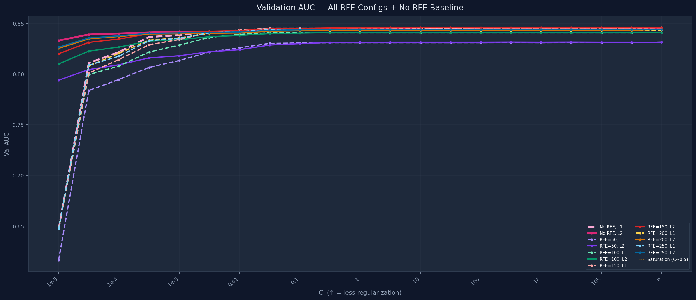

* `C>=0.5`-ის ზემოთ უკვე l1 და l2-ს ხაზები ძალიან უახლოვდება ერთმანდეთს. ეს სავარაუდოდ იმის გამო ხდება, რომ რეგულარიზაციის კოეფიციენტი ისედაც პატარაა და მოდელი ახერხებს ყველა მნიშვნელოვანი წონის შენარჩუნებას. 

* პატარა C-სთვის როგორც მოსალოდნელი იყო, l2 რეგულარიზაცია ბევრად უფრო სტაბილურია ვიდრე l1 რეგულარიზაცია.

უფრო დიდი მასშტაბით ავიღოთ **val_auc**:

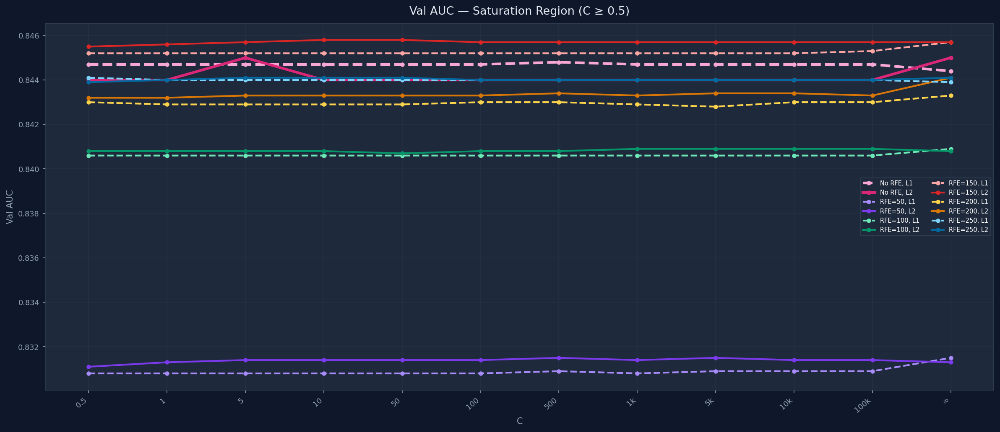

* აქ საინტერესო რაღაც იკვეთება. `RFE`-სგან დატოვებული **150** ცვლადით მოდელი უკეთეს შედეგს დებს, ხოლო უფრო მეტით - ოდნავ უარესს. ეს იმას ნიშნავს, რომ დამატებით სვეტებმა მოდელს უფრო მეტი **noise** მიაწოდა, ვიდრე სასარგებლო ინფორმაცია.  

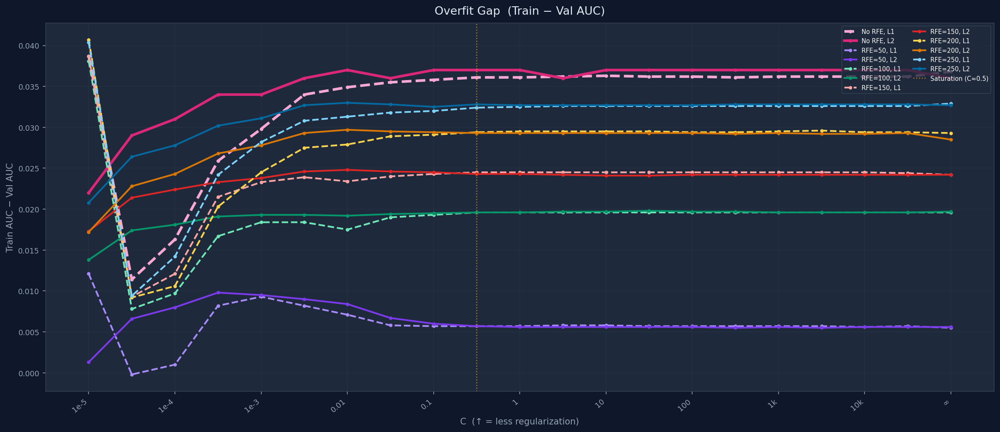

* თანაც, ზედა plot-ის მიხედვით **150** ცვლადის მქონე RFE-ს უფრო პატარა **overfit gap** აქვს უფრო მეტი ცვლადის მქონეს.

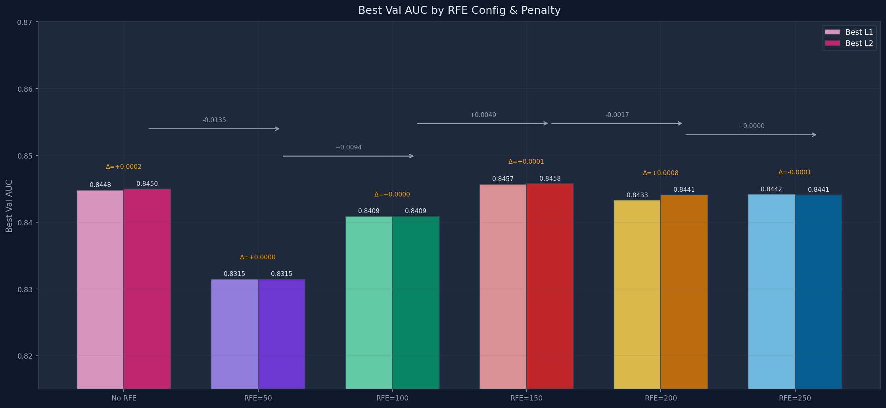

* საბოლოო ჯამში საუკეთესო შედეგი დადო `rfe__n_features_to_select=150` მქონე მოდელმა. სხვაობები მაინც ძალიან მცირეა, რადგან *LogisticRegression* არ არის საკმარისად კომპლექსური მოდელი და უფრო დახვეწილი `preprocessing`-ის გარეშე ვერ სწავლობს მონაცემებს. თუმცა, **overfit gap** საგრძნობლად შემცირდა და დაახლოებით 0.025 გახდა.

მაგრამ, კარგი წარმოდგენა შეგვექმნა რა შეუძლია baseline *LogisticRegression*-ს და შეგვიძლია ეს შემდეგი მოდელების ტრენინგის დროს გავითვალისწინოთ.

---

# Decision Tree

## Preprocessing

მიდგომა აქაც საკმაოდ მარტივია:

* გადავაგდე არაინფორმაციული სვეტები.


* რიცხვით სვეტებში **NA**-ები შევავსე რაღაც კონსტანტა -999 რიცხვით. მედიანით/საშუალოთი შევსება აქ დიდად მომგებიანი არ არის.*DecisionTree* -ისედაც ყველა რიცხვზე split-ს ცალ-ცალკე განიხილავს, შესაბამისად, NA-ების ცალკე რაღაც რიცხვით შევსება უკეთესი მგონია, რადგან რაღაც პატერნი თვითონ **NA**-ებშიც შეიძლება იყოს და ასე ცალკე გამოყოფით *DecisionTree* ცალკე ჯგუფად განიხილავს მას. 


* კატეგორიული სვეტები შევავსე OrdinalEncoder-ით, რომელიც სვეტში თითოეულ კატეგორიას უბრალოდ გადანომრავს. ასეთი მიდგომა *Logisticregression*-სთვის საკმაოდ ცუდი იქნებოდა, თუმცა ისეც *DecisionTree* რადგან მაინც split-ებს განიხილავს, დიდად მნიშვნელობა არ უნდა ჰქონდეს და თანაც მარტივი მიდგომაა baseline-სთვის. 


* აქ უკვე აღარ ვანორმალიზებ სვეტებს. *DecisionTree*-ს არ სჭირდება მონაცემების დანორმალიზება.


## Training & Results

* დავიწყე მხოლოდ სიღრმეების გადარჩება დაახლოებით რომ გამეგო შედეგები:
```python
    model_configs = {
        'max_depth':        [1, 3, 4, 5, 6, 7, 8, 10, 15, 20, 50, None],
        'class_weight':     ['balanced'],
        'criterion':        ['gini', 'entropy'],
    }
``` 

ერთმანეთს შევადარე train და validation შედეგები და ასეთი plot გამოვიდა:

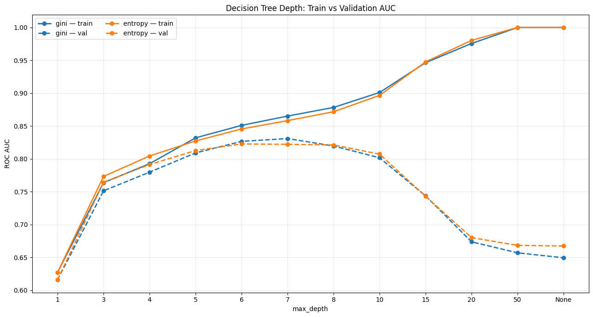


* დაბალი სიღრმის დროს აშკარა **underfit** გვაქვს, ხოლო მაღალი სიღრმის დროს აშკარა **overfit**.


* დაგვჭირდება სხვა რეგულარიზაციის მეთოდებიც. `depth=[4, 5, 6, 7]`-ზე კარგი **overfit gap**-ებია, თუმცა აქ რეგულარიზაცია კარგ შედეგებს ვერ მოგვცემს, რადგან ისედაც დაბალი **auc** შედეგები აქვს მოდელს ამ სიღრმეებზე, რადგან ნაკლებად კომპლექსურია. სხვა რეგულარიზაციის ხერხები აჯობებს მოვცადოთ ცოტა უფრო დიდ სიღრმეებზე, სადაც მოდელი საკმარისად კომპლექსურია და რეგულარიზაცია დაეხმარება უკეთ განზოგადებაში.კარგ შემთხვევაში `train_auc` შემცირდება, ხოლო `val_auc` გაიზრდება და ერთმანდეთთან გვინდა ახლოს მივიყვანოთ ეს ორი.


* ამის შემდეგ ავირჩიე ისეთი სიღრმე, რომელზეც მოდელს ჰქონდა მაღალი `train_auc` და შედარებით დაბალი `val_auc`. კერძოდ, ავირჩიე `depth=15` და ვცვალე სხვა რეგულარიზაციის ჰიპერპარამეტრი. ერთ-ერთი ჰიპერპარამეტრი, რომელსაც ვცვლიდი, იყო `min_samples_leaf` და გადავარჩიე შემდეგი მნიშვნელობები:
```python
model_configs = {
    'max_depth':        [15,],
    'min_samples_leaf': [1, 20, 50, 100, 150, 200, 300, 400, 500, 600, 700, 800, 900, 1000, 1100, 1300, 1500, 1800, 2000, 2500, 3000, 4000, 5000],
    'class_weight':     ['balanced'],
    'criterion':        ['entropy',],
}
```
ამის შემდეგ ავაგე plot, რომელიც გვიჩვენებს როგორ იცვლება `train_auc` და `val_auc` `min_samples_leaf`-ის ზრდასთან ერთად:

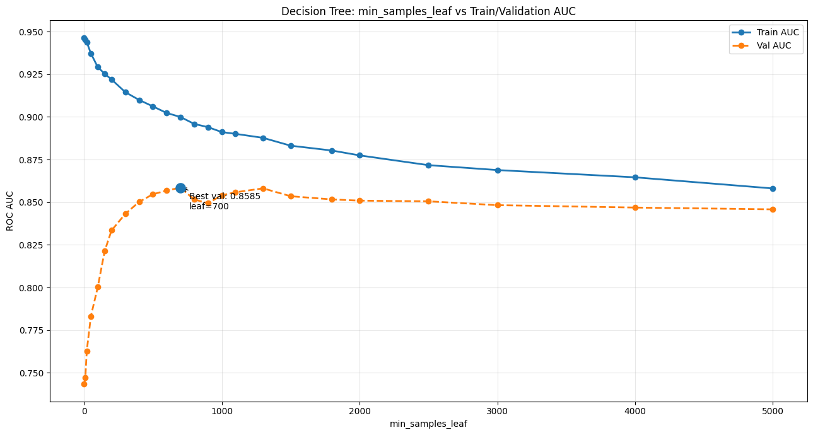

* ზუსტად ის მოხდა რასაც ვვარაუდობდით: `min_samples_leaf` რეგულარიზაციის ზრდასთან ერთად იზრდება `val_auc` და ამავე დროს მცირდება `train_auc`. ეს ის ქცევაა, რომელიც გვაწყობდა. `min_samples_leaf=700`-ზე მივიღეთ უკეთესი შედეგი `val_auc=0.8585`,  ანუ რეგულარიზაციის გარეშე საუკეთესო შედეგს აჯობა. `val_auc`-ის ზრდა და `train_auc`-ის შემცირება სულ არ გაგრძელდება, ცხადია. `min_samples_leaf=1200`-ის მერე უკვე ორივე მეტრიკა იკლებს, რადგან მოდელი უკვე ნელ-ნელა კარგავს კომპლექსურობას და ვეღარ სწავლობს **underfitting**-ის გამო. `min_samples_leaf=1`-ის დროს ძალიან დიდი **overfit** გვქონდა. საუკეთესო მნიშვნელობა, ანუ `min_samples_leaf=700` სადღაც შუაშია, როგორც წესი.


* ამის შემდეგ დავაფიქსირე `max_depth=15` და `max_depth=[500, 600, 700]` მიდამოში და სხვა პარამეტრების tuning ვცადე. ერთ-ერთი იყო `ccp_alpha=[0, 5e-6, 7e-6, 9e-6, 1e-5, 3e-5, 5e-5, 6e-5]` (`ccp_alpha` ხის რეგულარიზაციას post pruning-ით აკეთებს ხის აგების შემდეგ), თუმცა 

| ccp_alpha | train_auc          | val_auc            |
|----------:|-------------------:|-------------------:|
| 0         | 0.8999547882351735 | 0.8585222177665841 |
| 5e-6      | 0.8999414209516857 | 0.8584826573564504 |
| 6e-6      | 0.8999339712280761 | 0.8584942422463228 |
| 7e-6      | 0.8999247651384779 | 0.8585250308829836 |
| 8e-6      | 0.8998994150204392 | 0.8584333528798807 |
| 9e-6      | 0.8998994150204392 | 0.8584333528798807 |
| 1e-5      | 0.8998994150204392 | 0.8584333528798807 |
| 3e-5      | 0.8993977323756022 | 0.8584566341082263 |
| 5e-5      | 0.8980280060248735 | 0.8574279539176792 |
| 6e-5      | 0.8972851115014392 | 0.8562278946024282 |

`ccp_alpha=7e-6`-ის დროს გაიზარდა `val_auc`, მაგრამ ძალიან მცირედით.

* ასევე, ვცადე მხოლოდ `min_samples_leaf=700` ჰიპერპარამეტრით ხის აგება `max_depth=None`-ით და ოდნავ უკეთესი შედეგი მივიღე: `train_auc=0.9066450592086427` და `val_auc=0.8587093764759013` ანუ ოდნავ გაუმჯობესდა.


* სხვა ჰიპერპარამეტრების მოვცადე პარალელურად (`max_leaf_nodes`, `max_features`, `min_samples_split`), მაგრამ შედეგი არ გაუმჯობესდა.


* როგორც შევამჩნიე, ხისთვის უკეთესი შედეგის დადება ამ baseline `preprocessing`-ით არც ისე მარტივია. ხის მოდელი საკმაოდ კომპლექსურია და ეს კომპლექსურობა + noise დატაში გვაძლევს ოდნავ უფრო დიდ **overfit gap**-ს ხეებში *LogisticRegression*-თან შედარებით. *DecisionTree*-ებში დაახლოებით 0.041-ია, როცა *DecisionTree*-ში 0.025-მდე ჩამოვიყვანეთ ეს **overfit gap**. მაგრამ, *DecisionTree* გავაუმჯობესეთ შედეგი `val_auc=0.858`-მდე. აქ კიდევ უფრო კარგად გამოჩნდა, რომ *LogisticRegression* არ იყო საკმარისად კომპლექსური გადაცემული მონაცემებისთვის და მარტივმა *DecisionTree* თავისი კომპლექსურობით მოახერხა უკეთესი შედეგის დადება. თუმცა, ამ კომპლექსურობამ გამოიწვია training data-ში noise-სთვის მეტი ყურადღების მიქცევა, ანუ უფრო დიდი **overfitting gap**. ამის **overfitting gap**-ის გასაქრობად გადავწყვიტე ერთი *DecisionTree* ნაცვლად ბევრი *DecisionTree*-ის შედეგების აგრეგაცია, რაც ამ noise-ს დიდი ალბათობით გააბათილებს და უკეთეს შედეგებს მივიღებთ. 

---

# Random Forest

`RandomForest`-ის ტრენინგს უკვე საკმაოდ დიდი ხანი უნდება. **gpu accelarated** ვერსია აქვს `RandomForest`, მაგრამ დაუბალანსებელი დატას handling არ აქვს ავტომატურად. გავტესტე რამდენიმე ვარიანტი რაც მოვასწარი და შევადარე *DecisionTree*-ს.

##  Preprocessing

* `preprocessing` მიდგომა *DecisionTree*-ს მსგავსი ავირჩიე *RandomForest*-სთვისაც. 

## Training & Results

* ეს იყო პირველი ვარიანტი, რომელიც მოვსინჯე:
```python
    model_configs = {
        'n_estimators':     [300],
        'max_depth':        [15,],
        'min_samples_leaf': [700],
        'max_features':     [.2],
        'max_samples':      [.5],
        'criterion':        ['gini'],
        'class_weight':     ['balanced_subsample'],
        'bootstrap':        [True],
    }
```
წინა საუკეთესო *DecisionTree*-სთან შესადარებლად *RandomForest*-ში თითოეული ხისთვის ავიღე `max_depth=15` და `min_samples_leaf=700`. ასეთი ავიღე სულ 300 ცალი `n_estimators=300` და თითოეული ხის აგებისას data-ს სვეტებიდან ვიღებდი ცვლადების 20%-ს `max_features=0.2`, ხოლო datapoint-ების 50%-ს ვტოვებდი `max_samples=0.5`. ეს ერთი მხრივ გამოთვლის კომპლექსურობას ამცირებს, რადგან ისედაც დიდი დატაა და ტრენინგს დიდი ხანი შეიძლება მოუნდეს. თუმცა, მეორე მხრივ, ეს ხეებს ამქსიმალურად არაკორელირებულს ხდის და ქმნის იმის შთაბეჭდილებას, თითქოს ჭეშმარიტი განაწილებიდან ყოველი ხისთვის **დამოუკიდებლად** დავსემპლეთ datapoint-ები. **დამოუკიდებლად** დასემპლილ datapoint-ებისთვის გვაქვს სხვადასხვა noise, რომლებსაც ისწავლიან კომპლექსური ხეები და მათი შედეგების აგრეგაციის შემდეგ გაბათილდება ეს noise-ები. თუმცა, **bias** როგორც წესი არ გაუმჯობესდება, რადგან დამოუკიდებელი ხეების შედეგების აგრეგაცია **bias**-ს ვერ გაზრდის. პირიქით, შეიძლება გაუარესდეს კიდეც ხოლმე შედეგი, რადგან თითოეული ხე ახლა შემცირებულ dataset-ზე ტრეინდება. ამ მოდელის დატრენინგების შემდეგ მივიღე ასეთი შედეგი: 

| model | train_auc | val_auc |
|------:|----------:|--------:|
| DT    | 0.8999    | 0.8585  |
| RF    | 0.8916    | 0.8734  |

ანუ, როგორც მოსალოდნელი იყო, ოდნავ შემცირდა `train_auc`, თუმცა `val_auc` საკმაოდ მიუახლოვდა ტრენინგის შედეგს. შედეგად, **bias** ცოტა გაიზარდა, თუმცა **variance** უფრო შემცირდა (`train_auc - val_auc` შემცირდა) და ეს არის სწორედ *RandomForest*-ის მთავარი უპირატესობა *DecisionTree*-სთან შედარებით.

* ამ ვარიანტის გარდა ჰიპერპარამეტრების კიდევ სხვა მნიშვნელობებიც მოვცადე. მაგალითად, მოვცადე `max_depth=None` ვარიანტიც და ასეთ დროს *DecisionTree*-ს მსგავსად ძალიან დიდ `train_auc` ვიღებდი, ხოლო `train_auc - val_auc` სხვაობა დაახლოებით 0.1-ის ტოლი იყო. მაგალითად, RF_Training__n_estimators_300__depth_None__min_leaf_10__max_features_sqrt__max_samples_0.8__criterion_gini__class_weight_balanced_subsample მოდელისთვის მივიღე `train_auc=0.9916` და `val_auc=0.9010`.

* ერთ-ერთი საუკეთესო ვარიანტი, რომელიც აღმოჩნდა იყო შემდეგი პარამეტრებით:
```python
    model_configs = {
        'n_estimators':     [750],
        'max_depth':        [15,],
        'min_samples_leaf': [150],
        'max_features':     [.3],
        'max_samples':      [.5],
        'criterion':        ['gini'],
        'class_weight':     ['balanced_subsample'],
        'bootstrap':        [True],
    }
```
აქ `min_samples_leaf` ოდნავ შევამცირე, რომ მოდელის კომპლექსურობა გამეზარდა, `n_estimators` გავზარდე, რაღა ვარიაცია მაქსიმალურად შემემცირებინა და `max_features` ოდნავ გავზარდე, რათა **bias** შემემცირებინა და მივიღე ასეთი შედეგი: `train_auc=0.9349` და `val_auc=0.8921`. **overfit gap** *DecisionTree*-ს მსგავსია (მაინც არც ისე დიდია), თუმცა სამაგიეროდ ბევრად გაუმჯობესდა `val_auc=0.8921` წინ მოდელებთან შედარებით. ამ შედეგამდე მისასვლელად კიდევ ბევრი ექსპერიმენტი მაქვს *MLflow*-ზე დალოგილი.

* ამის შემდეგ უკვე გადავედი ensembling მეთოდზე, რომელშიც მოდელები დამოუკიდებლად prediction-ის ნაცვლად ერთმანეთის შეცდომებს სწავლობენ. ერთ-ერთი ასეთი არქიტექტურაა *XGBoost*.

---

# XGBoost

##  Preprocessing

* `preprocessing` აქ მარტივად დავიწყე. *XGBoost* აქვს NA-ების native handling, შესაბამისად ზოგიერთ სვეტში NA-ების imputing არ მქინია.


* გადავაგდე არაინფორმაციული სვეტები.


* რიცხვით სვეტებს საერთოდ არ შევეხე, რადგა *XGBoost* ამას natively დაჰენდლავს.


* კატეგორიულ სვეტებში NA შევავსე 'missing' მნიშვნელობით, რადგან თვითონ NA-ს ქონაც შეიძლება fraud-ის მიმთითებელი აღმოჩნდეს ან პირიქით. კატეგორული ცვლადები რიცხვითში აღარ გადამიყვანია, რადგან *XGBoost* ამასაც ჰენდლავს. 


## Training & Results

* დავიწყე ცოტა მძიმე მნიშვნელობების მოცდა. თავიდან მოცდილ ყველა მოდელში მქონდა `n_estimators=1000`, რაც ძალიან დიდ **overfit**-ს იწვევდა, შესაბამისად მქონდა ასეთი შედეგები:

    * XGBoost_Training__n_estimators_1000__max_depth_4__min_child_weight_1__reg_lambda_1__reg_alpha_0__gamma_0__lr_0.05__subsample_0.8__colsample_bytree_0.8__colsample_bylevel_0.8__scale_pos_weight_27.434310083918007__max_delta_step_0 -სთვის `train_auc=0.9652` და `val_auc=0.8866`.

    * XGBoost_Training__n_estimators_1000__max_depth_6__min_child_weight_1__reg_lambda_1__reg_alpha_0__gamma_0__lr_0.05__subsample_0.8__colsample_bytree_0.8__colsample_bylevel_0.8__scale_pos_weight_27.434310083918007__max_delta_step_0 -სთვის `train_auc=0.9920` და `val_auc=0.8933`.

    * XGBoost_Training__n_estimators_1000__max_depth_8__min_child_weight_1__reg_lambda_1__reg_alpha_0__gamma_0__lr_0.05__subsample_0.8__colsample_bytree_0.8__colsample_bylevel_0.8__scale_pos_weight_27.434310083918007__max_delta_step_0 -სთვის `train_auc=0.9995` და `val_auc=0.8974`.

ძალიან **overfitted** მოდელებს ვიღებდი. გადავწყვიტე, რომ n_estimators 300-მდე შემემცირებინა და გამეტესტა მოდელი ასეთი პარამეტრებით (`min_child_weight` ვზრდიდი თანდათან):
```python
    model_configs = {
    'n_estimators':         [300], 
    'max_depth':            [8],  
    'min_child_weight':     [50, 75, 100, 125, ..., 3000],  
    
    'reg_lambda':           [2],    
    'reg_alpha':            [.5],     
    'gamma':                [3],  
    
    'learning_rate':        [.05,], 
    'subsample':            [.8],        
    'colsample_bytree':     [.8],        
    'colsample_bylevel':    [1],      

    'scale_pos_weight':     [len(y_train[y_train==0]) / len(y_train[y_train==1])], 
    
    'tree_method':          ['hist'],
    'enable_categorical':   [True],            
}
```

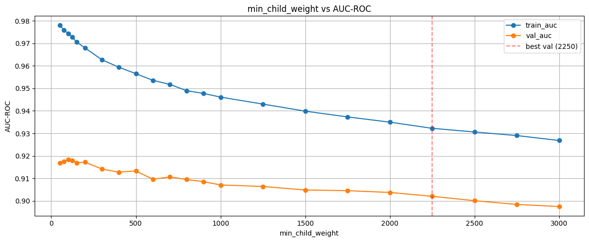


თავიდან ძალიან overfitting იყო მოდელი, თუმცა `min_child_weight`-ის გაზრდით თანდათან `train_auc` და `val_auc` ერთმანეთს უახლოვდება. საბოლოოდ, საუკეთესო ვარიანტად აქ დავაფიქსირე წერტილი, რომელშიც `train_auc - val_auc` მინიმალური იყო და `val_auc` მაქსიმალური იყო, ანუ `train_auc=0.9322` და `val_auc=0.9020`. **overfit gap** ნორმალურია (0.03) და `val_auc` საკმაოდ კარგია.

* ამის შემდეგ `subsample`, `colsample_bytree` `colsample_bylevel` სვეტებსაც ვცვლიდი, თუმცა დიდი გაუმჯობესება არ მოუტანია.

* ბოლოს, ვცვლიდი ხეების რეგულარიზაციის პარამეტრებს: `reg_lambda` და `reg_alpha`. თავიდან, `min_child_weight=2250` მქონდა და `reg_lambda`-ის გაზრდა მოდელში არაფერს ცვლიდა. როცა მივხვდი, რომ მელი რეგულარიზაცია `min_child_weight`-ზე მოდიოდა, თანდათან შევამცირე `min_child_weight` (100-მდე) და გავზარდე `reg_lambda` და ასეთი შედეგი მივიღე:

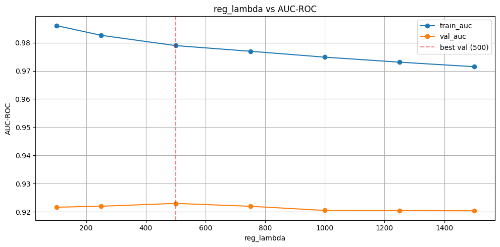

დავაფიქსირე `reg_lambda=500`.

* ახლა უკვე `reg_alpha`-ის tuning დავიწყე. გადავარჩიე `reg_alpha=[250, 500, 600, 700, 750]` წონები და ამავე დროს გადავარჩიე `reg_lambda=[500, 600, 650]` 500-ის სიახლოვეში და საუკეთესო შედეგი დამისვა:
    
    *  XGBoost_Training__n_estimators_400__max_depth_10__min_child_weight_200__reg_lambda_600__reg_alpha_600__gamma_0__lr_0.   05__subsample_0.8__colsample_bytree_0.85__colsample_bylevel_1__scale_pos_weight_27.434310083918007__max_delta_step_0-სთვის `train_auc=0.9511` და `val_auc=0.9116`. 

`train_auc - val_auc` წინასთან შედარებით მაღალია, თუმცა სამაგიეროდ `val_auc` ამ შემთხვევაში უფრო მეტია.

ამის შემდეგ სხვა ჰიპერპარამეტრბის tuning ვცადე, თუმცა დიდად უკეთესი შედეგი არ მიმიღია.


---


# Better Preprocessing For XGBoost

*XGBoost*-ს აშკარად უკეთესი შედეგები ჰქონდა წინებთან შედარებით, ამიტომ ახლა გადავწყვიტე დამეხვეწა *XGBoost*-ის `preprocessing`.


## High NA Columns

* baseline დატა საკმაოდ დიდ მეხსიერებას იკავებს, ამიტომაც რაღაც feature-ების ამოგდება შეიძლება. თანაც ზოგიერთი feature დიდად ინფორმაციული არ არის ტრანზაქცია fraud-ობის დადგებისთვის. ერთ-ერთი ვარიანტი არის, რომ დავითვალოთ NA-ების პროცენტულობა სვეტებში და მაგის მიხედვით ამოვაგდოთ სვეტები. ასეთი შედეგი მივიღე:

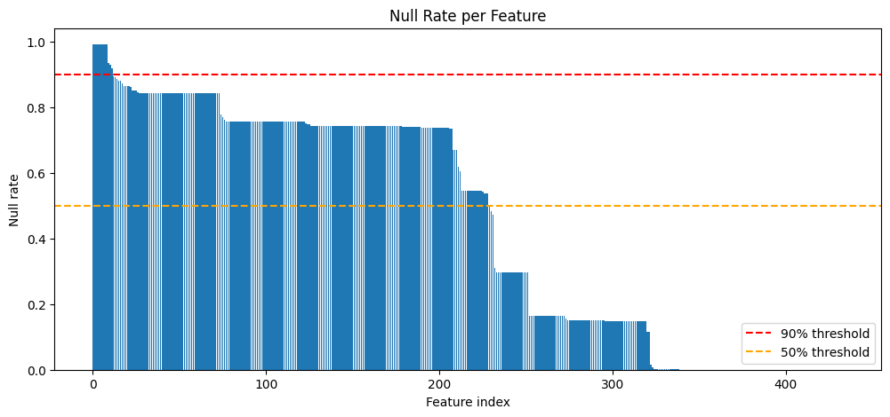

გადავაგდე ყველა სვეტი, რომელშიც 90%-ზე მეტი NA იყო.


## Outliers

* დატაში outlier-ებმა ზოგადად დიდი პრობლემა შეიძლება შექმნან და ეს პირველ დავალებაშიც ვნახეთ. გადავხედე `TransactionAmt` მნიშვნელობებს და ასეთი რამ ვნახე:

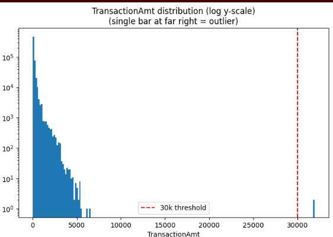

`TransactionAmt=30000`-ის ზემოთ ვხედავთ outlier-ებს, შესაბამისად აჯობებს ეს წერტილები ამოვაგდოთ `train_df`-დან.


## V Columns


* Kaggle-ის discussion-ებში ვეძებდი `V1`, ... `V339` სვეტები რას აღნიშნავდნენ. თავიდან როცა გადავხედე ამ სვეტებს და გავუყევი, შევამჩნიე, რომ გარკვეულ `Vi`-დან დაწყებული `Vj`-მდე თუ რომელიმეს სვეტს NA ეწერა ცვლადში მაშინ ყველას ეწერა. შესაბამისად, ამ ჯგუფის მნიშვნელობები რაღაც კავშირში უნდა ყოფილიყვნენ ერთმანეთთან. მოგვიანებით გავარკვიე, რომ ეს V სვეტები არის Vesta-ს engineered ცვლადები და თითოეული ჯგუფის ცვლადი დიდი ალბათობით ერთმანეთზე იყო დამოკიდებული და NA-ების რაოდენოა მაგიტომ ჰქონდათ იგივე ერთ ჯგუფში შემავალ სვეტებს:

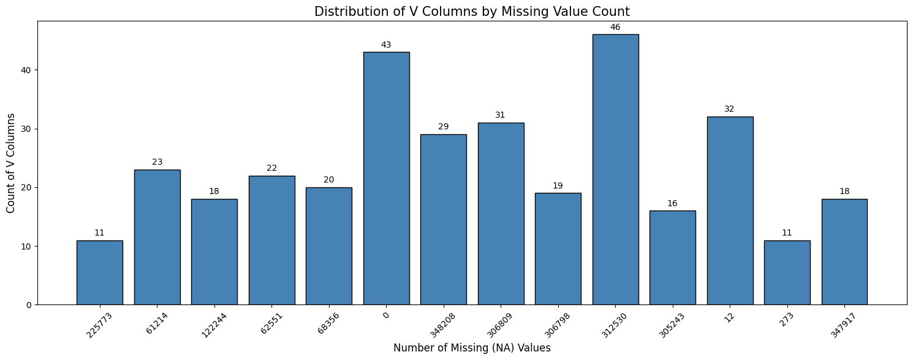

V სვეტების კორელაცია როცა დავითვალე, საკმაოდ კორელირებლები აღმოჩნდნენ ერთმანეთთან. ასევე, ვნახე feature_importance.csv, რომელსაც ყოველი მოდელის დატრენინგების შემდეგ ვლოგავდი MLflow-ზე. აღმოჩნდა, რომ V სვეტების უმეტესობას ძალიან დაბალი feature importance ჰქონდათ და ბოლო ადგილებს იკავებდნენ ძირითადად:

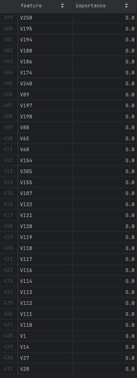


იმის ნაცვლად, რომ პირდაპირ გადავყაროთ მაღალ-კორელირებული სვეტები ერთი საინტერესო მიდგომა ვნახე Kaggle-ის discussion-ებში: 

* სვეტები დავაჯგუფოთ NA რაოდენობის მიხედვით.

* თითოეულ ჯგუფში დავტოვოთ წარმომადგენელი სვეტები და დანარჩენი სვეტები გადავყაროთ.

* წარმომადგენელი სვეტების გასაგებად მოვიქცეთ შემდეგნაირად: მოცემულ ჯგუფში სვეტებს შორის დავთვალოთ კორელაციები. მაგალითად:

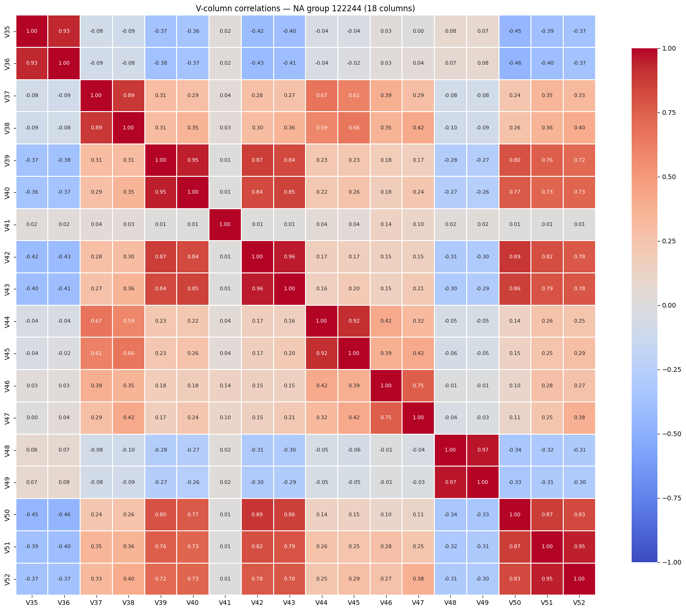

* ავიღოთ რაიმე `threshold` (მე `threshold=0.75` ავიღე). 

* ამოვწეროთ ყველა წყვილი სვეტი, რომელთა შორის კორელაციაც > `threshold=0.75`-ზე. ყველა წყვილი, რომელთაც ერთი მაინც საერთო ელემენტი აქვთ (ელემენტი სვეტია ამ შემთხვევაში) გავაერთიანოთ და დავარქვათ მათ გაერთიანებას კლასტერი. გვექნება რამდენიმე კლასტერი და თითოეული კლასტერიდან ამოვირჩიოთ ერთი წარმომადგენელი. ჩვენს შემთხვევაში ამოვირჩიოთ წარმომადგენელი ცვლადი ყველაზე დიდი მნიშვნელობათა სიმრავლის ზომით.ამ მიდგომის ერთ-ერთი უპირატესობა ისაა, რომ ტოლი რაოდენობის NA-ების მქონე სვეტებს ვირჩევთ საუკეთესოს.


* ამ მიდგომით 144 ცალი V სვეტი გადავაგდეთ.


საბოლოოდ, ამ მიდგომით ამოცანის computational complexity საკმაოდ შემცირდა.

IEEE-CIS_Fraud_Detection_XGBoost_Training__prep_v2-ში ამაზე ჩავატარე ექსპერიმენტი და საუკეთესო შედეგი ასეთი გამოვიდა:

* XGBoost_Training__n_estimators_2000__early_stop__100__max_depth_12__min_child_weight_100__reg_lambda_600__reg_alpha_600__gamma_0__lr_0.01__subsample_0.8__colsample_bytree_0.8__colsample_bylevel_1__scale_pos_weight_27.434172513413124__max_delta_step_0-სთვის `train_auc=0.9555` და `val_auc=0.9122`. 

წინა მოდელებთან შედარებით ოდნავ უკეთესი შედეგებია.


## Categorical Features

* კატეგრიული სვეტებისთვის ოდნავ გავაუმჯობესე encoding სტრატეგია. კერძოდ, თუ ცვლადს `threshold=10`-ზე ნაკლები განსხვავებული კატეგორიული მნიშვნელობა აქვს, მაშინ ვაკეთებ One-Hot_encoding, ხოლო სხვა შემთხვევაში FrequencyEncoding-ს.

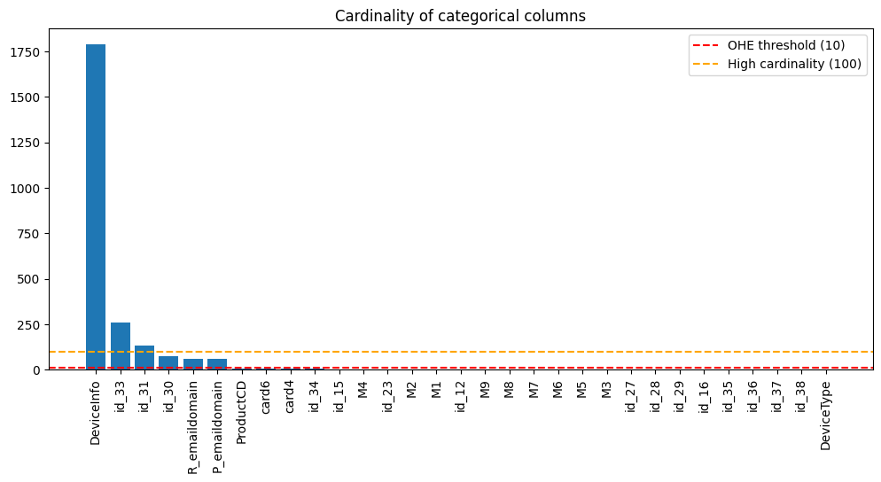


## Feature Engineering

* დავამატე fraud rate კვირის დღეებისა და დღის საათების მიხედვით. `TransactionDT`-სთან შედარებით უფრო მეტად dense კატეგორიებია და მოდელს უნდა დაეხმაროს დაპროგნოზებაში:

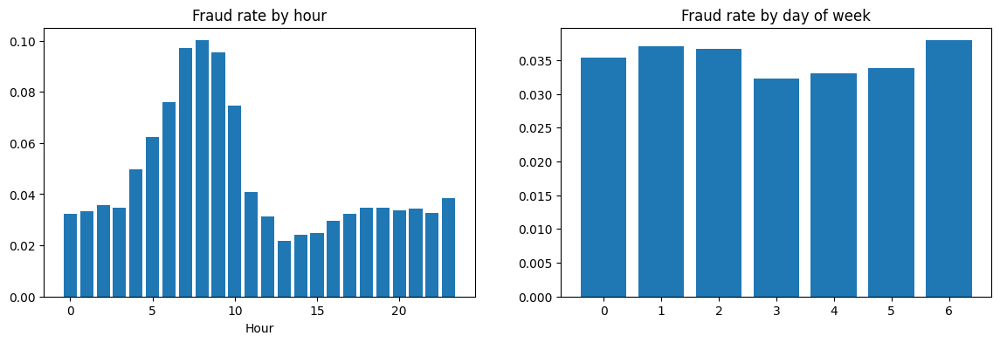


* ასევე დავამატე `log(TransactionAmt)`, რადგან `TransactionAmt` ძალიან skewed იყო და ახლა XGBoost rate-ით განიხილავს თითოეულ შუალედს `log(TransactionAmt)`-ებს შორის.


აქაც ბევრი ძებნის შემდეგ საუკეთესო აღმოჩნდა:

XGBoost_Training__n_estimators_400__max_depth_10__min_child_weight_200__reg_lambda_500__reg_alpha_500__gamma_0__lr_0.05__subsample_0.8__colsample_bytree_0.8__colsample_bylevel_1__scale_pos_weight_27.434172513413124__max_delta_step_0-სთვის `train_auc=0.9574` და `val_auc=0.9108`. 

---

## Choosing Best Model

საუკეთესო მოდელსთვის რამდენიმე კანდიდატი გვყავს:

* XGBoost_Training__n_estimators_400__max_depth_10__min_child_weight_200__reg_lambda_500__reg_alpha_500__gamma_0__lr_0.05__subsample_0.8__colsample_bytree_0.8__colsample_bylevel_1__scale_pos_weight_27.434172513413124__max_delta_step_0-სთვის `train_auc=0.9574` და `val_auc=0.9108` და `model_id=m-5d264827e8a946d8b82bfa72500de9dd`

* XGBoost_Training__n_estimators_2000__early_stop__100__max_depth_12__min_child_weight_100__reg_lambda_600__reg_alpha_600__gamma_0__lr_0.01__subsample_0.8__colsample_bytree_0.8__colsample_bylevel_1__scale_pos_weight_27.434172513413124__max_delta_step_0-სთვის `train_auc=0.9555` და `val_auc=0.9122` და `model_id=m-c169587b27bc4f6a8dc58c8340d4bd14`


* XGBoost_Training__n_estimators_400__max_depth_10__min_child_weight_200__reg_lambda_600__reg_alpha_600__gamma_0__lr_0.   05__subsample_0.8__colsample_bytree_0.85__colsample_bylevel_1__scale_pos_weight_27.434310083918007__max_delta_step_0-სთვის `train_auc=0.9511` და `val_auc=0.9116` და `model_id=m-84f66192953248cfb53d1a36c68c23f5`

---

სამივე გავუშვათ `test_df`-ზე რომელიც სულ თავიდან გამოვყავით, ვნახოთ რა შედეგს დადებენ და აქედან საუკეთესო დავასაბმითოთ კეგლზე. 

test_df-ზე მივიღეთ შემდეგი ქულები, შესაბამისად:

* `test_auc=0.9006`

* `test_auc=0.9006`

* `test_auc=0.9005`


ამ მოდელებს შორის დიდად მნიშვნელოვანი სხვაობა არ არის, მაგრამ პირველ ორ მოდელს შორის პირველი ავარჩიე, რადგან მისი გადატრენინგება მთლიან დატაზე უფრო მარტივია და კიდევ ერთი ვალიდაციის სეტი არ დაგვჭირდება. ანუ, ავირჩიეთ:

*  XGBoost_Training__n_estimators_400__max_depth_10__min_child_weight_200__reg_lambda_500__reg_alpha_500__gamma_0__lr_0.05__subsample_0.8__colsample_bytree_0.8__colsample_bylevel_1__scale_pos_weight_27.434172513413124__max_delta_step_0

მთლიან დატაზე ხელახლა დავატრეინოთ (ეს მნიშვნელოვანია, რადგან დატა ისედაც არ არის დაბალანსებული) და ავტვირთოთ კეგლზე.

---

# Kaggle Result

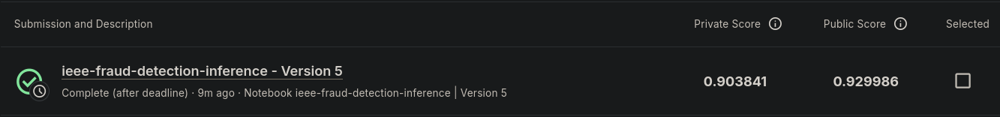

---

## MLflow ექსპერიმენტები DagsHub-ზე

ყველა run დარეგისტრირებულია:
 [dagshub.com/sbolk23/IEEE-CIS-Fraud-Detection-Kaggle-Competition](https://dagshub.com/sbolk23/IEEE-CIS-Fraud-Detection-Kaggle-Competition.mlflow)

თითოეულ run-ში დაილოგა:
- ყველა ჰიპერპარამეტრი
- Train / Val მეტრიკები
- დატრენინგებული მოდელის არტეფაქტი (`.pkl`)

---